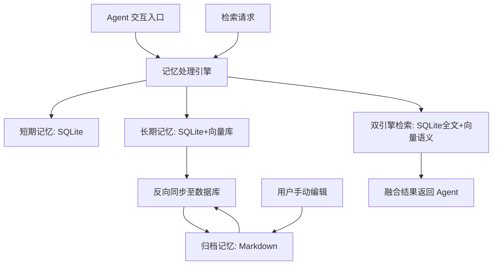

# 三合一融合型 Agent 记忆系统方案
结合 **Markdown（透明可读）+ SQLite（结构化/高速检索）+ 向量数据库（语义理解）** 的核心思路：**分层记忆、各司其职、自动同步、双向互通**。
- 用 **SQLite** 做**核心结构化存储**（会话、元数据、索引、事务），保证速度和数据可靠性；
- 用 **向量数据库** 做**语义检索层**（相似度匹配、模糊查询），支撑 LLM 智能联想；
- 用 **Markdown** 做**人类可读层+归档层**（手动编辑、版本控制、永久沉淀），解决黑盒问题；
三者通过**记忆引擎**自动同步，无需人工维护，完美互补单一方案的短板。

## 一、核心设计定位
### 1. 三层记忆架构（Agent 记忆标准范式）
| 记忆层级 | 存储载体 | 核心作用 | 数据特点 |
|----------|----------|----------|----------|
| **短期工作记忆** | SQLite | 存储当前会话上下文、临时交互数据 | 高频读写、生命周期短、结构化强 |
| **长期核心记忆** | SQLite + 向量数据库 | 存储用户偏好、事实知识、历史经验 | 永久留存、需语义+结构化双检索 |
| **归档可读记忆** | Markdown | 长期记忆的人类可读沉淀、手动编辑 | 纯文本、可版本控制、无数据库依赖 |

### 2. 三组件分工（无重叠、全互补）
| 组件 | 核心职责 | 不可替代的优势 |
|------|----------|----------------|
| **Markdown** | 记忆归档、手动编辑、Git 版本控制、人类可读沉淀 | 极致透明、零依赖、可手动修改 |
| **SQLite** | 结构化数据存储、全文检索、事务保证、元数据管理 | 高速 CRUD、精准查询、数据安全 |
| **向量数据库** | 语义向量存储、相似度检索、非结构化文本理解 | 模糊查询、LLM 友好、智能联想 |

---

## 二、系统整体架构


### 核心模块说明
1. **记忆处理引擎**：系统大脑，负责数据写入、检索、同步、遗忘、提炼；
2. **双引擎检索**：同时调用 SQLite（精准）+ 向量库（语义），融合最优结果；
3. **自动同步器**：数据库记忆 ↔ Markdown 文档双向自动同步，保证数据一致；
4. **记忆提炼器**：定期将短期记忆压缩为长期记忆，将长期记忆导出为 Markdown。

---

## 三、详细存储设计
### 1. Markdown 存储规范（轻量化、人类友好）
采用**固定目录结构**，纯文本存储，支持 Git 版本控制：
```
memory/
├── daily/                # 每日短期记忆归档（自动生成）
│   └── 2025-01-01.md
├── long_term/            # 长期核心记忆（自动+手动）
│   ├── preferences.md    # 用户偏好（可手动编辑）
│   ├── facts.md          # 事实知识（可手动编辑）
│   └── experiences.md     # 历史经验
└── archive/              # 永久归档（压缩后的历史记忆）
    └── v1.0_archive.md
```

**Markdown 文件格式示例**（统一模板，方便解析）：
```markdown
# 用户偏好 | 2025-01-01 更新
- 饮食：素食，不吃辛辣
- 工作：每日9:00-18:00，周末休息
- 偏好：喜欢简洁的回答，拒绝冗余

# 关联ID（映射数据库主键，用于同步）
- sqlite_id: 1001
- vector_id: vec_1001
```

### 2. SQLite 结构化设计（核心数据表）
单文件数据库（`agent_memory.db`），内置 **FTS5 全文索引**，4张核心表：
```sql
-- 1. 短期会话记忆（高频读写）
CREATE TABLE short_term_memory (
    id INTEGER PRIMARY KEY AUTOINCREMENT,
    session_id TEXT NOT NULL,        -- 会话ID
    content TEXT NOT NULL,           -- 交互内容
    create_time DATETIME DEFAULT CURRENT_TIMESTAMP,
    expire_time DATETIME             -- 过期时间
);

-- 2. 长期核心记忆（结构化+全文检索）
CREATE TABLE long_term_memory (
    id INTEGER PRIMARY KEY AUTOINCREMENT,
    type TEXT NOT NULL,              -- 偏好/事实/经验
    content TEXT NOT NULL,           -- 记忆内容
    md_path TEXT,                    -- 关联Markdown文件路径
    create_time DATETIME DEFAULT CURRENT_TIMESTAMP,
    weight INTEGER DEFAULT 1         -- 记忆权重（用于遗忘）
);
-- 全文检索索引
CREATE VIRTUAL TABLE long_term_fts USING fts5(content);

-- 3. 实体表（用户/物品/概念，结构化知识）
CREATE TABLE entities (
    id INTEGER PRIMARY KEY AUTOINCREMENT,
    name TEXT NOT NULL,
    type TEXT NOT NULL,
    attributes TEXT                  -- JSON格式属性
);

-- 4. 同步映射表（Markdown ↔ 数据库）
CREATE TABLE sync_mapping (
    sqlite_id INTEGER,
    vector_id TEXT,
    md_path TEXT,
    update_time DATETIME,
    PRIMARY KEY (sqlite_id, vector_id)
);
```

### 3. 向量数据库设计（轻量 Chroma 嵌入式）
无需独立服务，直接嵌入项目，与 SQLite 共享数据：
- **向量集合**：`long_term_memory`（仅存储长期记忆向量）
- **存储内容**：
  1. 向量嵌入（由 `sentence-transformers` 生成）
  2. 元数据：`sqlite_id`、`type`、`md_path`（关联SQLite和Markdown）
- **检索能力**：余弦相似度搜索 + 元数据过滤（精准+语义结合）

---

## 四、核心工作流程
### 1. 记忆写入流程（Agent 交互时）
1. Agent 接收用户输入 → 记忆引擎**先写入 SQLite 短期记忆**（高速）；
2. 会话结束 → 引擎**提炼关键信息**，写入 SQLite 长期记忆 + 生成向量写入向量库；
3. 自动同步器**将长期记忆同步为 Markdown 文档**（按分类存入对应文件）；
4. 更新 `sync_mapping` 表，绑定三者唯一ID。

### 2. 记忆检索流程（Agent 需要调用记忆时）
1. Agent 发起检索请求 → 引擎**同时触发双检索**：
   - SQLite：FTS5 全文精准匹配（关键词、实体）；
   - 向量库：语义相似度匹配（模糊、意思相近）；
2. 引擎对结果**加权融合**（精准结果权重更高）；
3. 返回最终记忆给 Agent，同时可读取 Markdown 补充人类编辑的内容。

### 3. 双向同步流程（核心特性）
- **自动同步**：数据库记忆更新 → 实时更新对应 Markdown 文件；
- **手动同步**：用户编辑 Markdown → 引擎解析内容 → 回写 SQLite + 更新向量库；
- **冲突解决**：以 Markdown 手动修改为最高优先级（用户掌控数据）。

### 4. 记忆遗忘与压缩
- SQLite：自动删除过期短期记忆，降低低权重长期记忆；
- 向量库：删除对应低权重向量，节省空间；
- Markdown：**永不删除**，仅归档（保留所有历史沉淀）。

---

## 五、关键技术特性
### 1. 全栈轻量化（无服务器、零部署）
- 全部采用**嵌入式组件**：SQLite（内置）+ Chroma（本地文件）+ Markdown（纯文本）；
- 无需 MySQL、Neo4j、Elasticsearch 等外部服务，单机直接运行。

### 2. 双检索增强（精准+语义）
- 解决 SQLite 不会语义理解、向量库不会精准匹配的问题；
- 示例：用户问「我不爱吃什么」→ SQLite 精准查偏好 + 向量库语义匹配相关记忆。

### 3. 极致透明可控
- 所有记忆可直接打开 Markdown 编辑，无需数据库工具；
- 支持 Git 版本控制，可回滚任意历史记忆修改。

### 4. 数据安全可靠
- SQLite 提供事务、WAL 模式，保证数据不丢失；
- Markdown 作为冷备份，即使数据库损坏，可一键重建所有记忆。

---

## 六、推荐技术栈（Python 开箱即用）
| 模块 | 技术选型 | 理由 |
|------|----------|------|
| 开发语言 | Python 3.10+ | Agent/LLM 生态最成熟 |
| 结构化存储 | SQLite 内置 | 轻量、事务、全文索引 |
| 向量数据库 | Chroma | 嵌入式、零配置、兼容 SQLite |
| 向量嵌入 | sentence-transformers | 轻量中文嵌入模型 |
| Markdown 操作 | python-markdown + frontmatter | 解析/生成 Markdown |
| 版本控制 | Git | 记忆历史追溯 |
| LLM 适配 | 通用 OpenAI API | 兼容所有大模型 |

---

## 七、落地实施步骤（5步快速搭建）
1. **初始化存储**：创建 Markdown 目录 + SQLite 数据库 + Chroma 向量库；
2. **开发核心引擎**：实现记忆写入、检索、同步三大核心函数；
3. **对接 Agent**：将记忆系统集成到 Agent 的 prompt 上下文；
4. **配置自动同步**：开启数据库 ↔ Markdown 双向同步；
5. **优化迭代**：添加记忆提炼、遗忘机制、版本控制。

---

## 八、方案核心优势（对比单一方案）
| 方案 | 单一方案短板 | 三合一方案解决方式 |
|------|--------------|---------------------|
| Markdown | 大数据检索慢、无结构化 | SQLite+向量库提供高速检索 |
| SQLite | 无语义理解、黑盒 | 向量库做语义检索，Markdown 做透明层 |
| 向量库 | 数据不可读、精准匹配差 | SQLite 精准检索，Markdown 可读归档 |

**总结**：这是一套**兼顾透明性、结构化、语义智能、轻量化**的企业级/个人级 Agent 记忆方案，完美适配个人 AI 助手、智能客服、知识型 Agent 等场景。

---

## 九、场景演示
1. **用户说**：「我以后只喝无糖饮料」
2. **系统写入**：SQLite 长期记忆 → 生成向量 → 同步到 `long_term/preferences.md`；
3. **用户问**：「帮我推荐适合我的饮料」
4. **系统检索**：
   - 向量库：语义匹配「饮料偏好」；
   - SQLite：全文匹配「无糖饮料」；
5. **Agent 回答**：「根据你的偏好，为你推荐无糖茶饮、无糖咖啡」；
6. **用户手动修改**：打开 Markdown 把「无糖」改成「低糖」→ 自动同步回数据库。