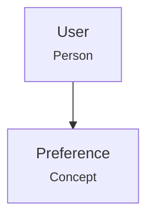

# AGENTS.md — export/

**Role**: Markdown export for human readability and Git version control
**Layer**: Cross-layer (exports L2 Content + L3 Knowledge)
**Dependencies**: jinja2, pydantic

---

## Module Overview

Exports memory data to Markdown format using Jinja2 templates. Enables transparent, human-readable, Git-trackable memory exports.

### Files

| File | Purpose | Key Classes |
|------|---------|-------------|
| `__init__.py` | Public API | `MarkdownExporter`, `ExportLayer`, `ExportResult` |
| `exporter.py` | Core logic (680 lines) | `MarkdownExporter` |
| `templates/*.j2` | Jinja2 templates | 5 template files |

---

## Key Classes

### MarkdownExporter

```python
exporter = MarkdownExporter(L0, L1, L2, L3)
result = await exporter.export_all(scope)
# Returns: ExportResult with stats
```

| Method | Description | Output |
|--------|-------------|--------|
| `export_layer_2(scope, ...)` | Export L2 Content | `dict` with counts |
| `export_layer_3(scope, ...)` | Export L3 Knowledge | `dict` with counts |
| `export_all(scope)` | Full export | `ExportResult` |

### ExportResult (Pydantic)

| Field | Type | Description |
|-------|------|-------------|
| `status` | `str` | "ok" |
| `export_path` | `str` | Output directory |
| `L2_content` | `dict` | Document/conversation counts |
| `L3_knowledge` | `dict` | Fact/entity counts |
| `total_files` | `int` | Total exported |

---

## Templates

| Template | Output |
|----------|--------|
| `content.md.j2` | Documents + conversations with tiered views |
| `fact.md.j2` | Individual facts with trace chain |
| `facts_by_type.md.j2` | Aggregated by fact type |
| `entities.md.j2` | Entity graph with Mermaid flowchart |
| `README.md.j2` | Export overview with stats |

---

## Export Directory Structure

```
~/.agents_mem/export/{user_id}/
├── README.md                    # Overview
├── metadata.json                # Export metadata
├── L2-content/
│   ├── documents/{YYYY-MM}/{id}.md
│   └── conversations/{YYYY-MM}/{id}.md
├── L3-knowledge/
│   ├── facts/{YYYY-MM}/{id}.md
│   ├── facts/by-type/{type}.md
│   └── entities/entity-graph.md
```

---

## Layer Dependencies

| Layer | Usage |
|-------|-------|
| **L0 Identity** | `validate_scope_or_raise()` |
| **L2 Content** | `list()`, `get_tiered_view()`, `get_messages()` |
| **L3 Knowledge** | `search_facts()`, `trace_fact()`, `aggregate_entities()` |

---

## Testing

```bash
pytest tests/test_export/ -xvs
```

**Coverage requirement**: 100%

---

## Mermaid Graph

Entity graph exported as Mermaid flowchart:

```

```